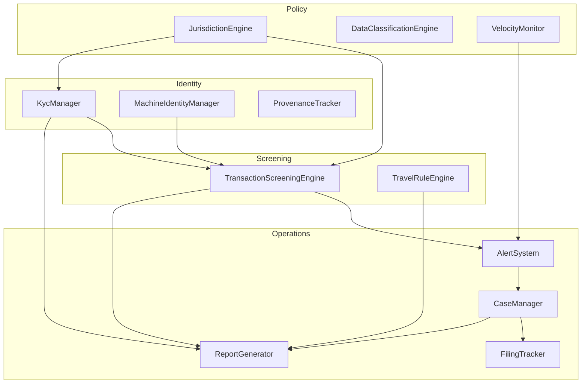

# @aethelred/wallet-compliance

> Composable compliance primitives for Web3 custody. Typed TypeScript
> building blocks for VASPs, fintechs, banks, and asset managers that need
> to meet FATF, MiCA, SOC 2, and jurisdiction-specific obligations.

## Status

`0.1.0` — initial SDK scaffolding. The package is used in production by the
Aethelred Wallet extension. The public surface is being finalized with
design-partner VASPs and fintechs; expect breaking changes across `0.1.x`
minors until we cut `1.0.0`. See [CHANGELOG.md](./CHANGELOG.md).

## What this SDK is

`@aethelred/wallet-compliance` is the regulated-enterprise layer of the
Aethelred Wallet. It is _not_ a turnkey AML platform; it is a set of typed
primitives that you plug into your own signing, approval, and reporting
pipelines. Each primitive is an in-memory, event-sourced class with snapshot
hooks so you can persist state into your database of choice (Postgres,
DynamoDB, Redis, event store, etc.) without the SDK prescribing a backend.

Because each primitive is isolated, you adopt only the pieces you need. A
bank that already has an industrial-strength case management platform can
consume the jurisdiction engine and velocity monitor without adopting the
`CaseManager`. A pure-play VASP can compose KYC + screening + Travel Rule +
alerts with no case management at all.

## Who this SDK is for

- **VASPs** that need FATF Travel Rule, sanctions screening, and SAR filing.
- **Fintechs and neobanks** integrating Web3 custody into existing AML
  programs.
- **Banks and asset managers** with MiCA, FCA, MAS, or ADGM obligations.
- **Compliance engineering teams** building in-house consoles who want typed
  building blocks rather than a black-box SaaS.
- **Sovereign and semi-sovereign entities** requiring HIPAA / FIPS-tier data
  classification alongside financial compliance.

## What it provides (14 primitives)

| Primitive                      | One-liner                                                               |
| ------------------------------ | ----------------------------------------------------------------------- |
| `KycManager`                   | Multi-level KYC/AML (basic → institutional) with risk scoring.          |
| `TransactionScreeningEngine`   | OFAC, mixer, and high-risk jurisdiction screening with decisioning.     |
| `TravelRuleEngine`             | FATF Travel Rule PII exchange and VASP coordination.                    |
| `ReportGenerator`              | SAR/CTR/SOC2/MiCA report generation with SHA-256 integrity hashes.      |
| `DataClassificationEngine`     | HIPAA / GDPR / defense classification + consent lifecycle.              |
| `MachineIdentityManager`       | AI / IoT / oracle identity with human-approval gates and rate limits.   |
| `ProvenanceTracker`            | Chain-of-custody and attestation records.                               |
| `CaseManager`                  | Investigation lifecycle with hashed evidence chains.                    |
| `AlertSystem`                  | Deduplicated alerts with escalation and audit history.                  |
| `JurisdictionEngine`           | Country-keyed AML thresholds, sanctions lists, KYC rules.               |
| `VelocityMonitor`              | Count / volume / counterparty velocity with breach alerts.              |
| `FilingTracker`                | SAR / CTR / MiCA regulatory filing lifecycle.                           |
| Core domain types (`./types`)  | KYC, Travel Rule, screening, reporting, classification, provenance.     |
| Enterprise types (`./enterprise-types`) | Workflow state machines, cases, alerts, velocity, filings.     |

## Install

This package currently ships as part of the Aethelred Wallet monorepo. It
will be published to npm when the public-license decision is finalized.
Until then, consume it via workspace reference:

```jsonc
// package.json
{
  "dependencies": {
    "@aethelred/wallet-compliance": "file:../compliance"
  }
}
```

## Quick start

### 1. KYC verification flow

```ts
import { KycManager } from "@aethelred/wallet-compliance";

const kyc = new KycManager();

// Create a profile for a corporate customer under UK law.
const profile = kyc.createProfile("subject-acme-ltd", "corporation", "GB");

// Upload supporting documents — each doc's content hash is stored, the
// contents themselves remain in your document store.
kyc.addDocument(profile.id, {
  type: "incorporation-cert",
  hash: "sha256:a1b2c3...",
});

// Submit the profile to your downstream verifier (Sumsub, Onfido, Jumio,
// Veriff, or in-house). When results return, update the profile.
kyc.submitForVerification(profile.id);
kyc.updateVerification(profile.id, {
  identityVerified: true,
  addressVerified: true,
  sanctionsScreened: true,
  pepScreened: true,
});

// `isVerified` checks both status and expiry.
if (kyc.isVerified(profile.id)) {
  // Allow onboarding.
}
```

See [`examples/kyc-flow.ts`](./examples/kyc-flow.ts) for the full
end-to-end example including error handling.

### 2. Transaction screening against OFAC + FATF high-risk jurisdictions

```ts
import { TransactionScreeningEngine } from "@aethelred/wallet-compliance";

const screening = new TransactionScreeningEngine();

const result = await screening.screenTransaction({
  fromAddress: "0xabc...",
  toAddress: "0xd90e2f925da726b50c4ed8d0fb90ad053324f31b", // Tornado Cash
  amount: "5000",
  asset: "USDC",
  counterpartyJurisdiction: "IR", // Iran — FATF high-risk
});

// Decision is one of: approve | review | escalate | block.
if (result.decision === "block") {
  throw new Error(`Blocked: sanctions=${result.sanctionsFlag}`);
}
```

See [`examples/transaction-screening.ts`](./examples/transaction-screening.ts).

### 3. Alert escalation with audit trail

```ts
import { AlertSystem } from "@aethelred/wallet-compliance";

const alerts = new AlertSystem();

const alert = alerts.createAlert({
  category: "sanctions-match",
  severity: "high",
  title: "Outbound transfer to sanctioned address",
  description: "Screening match against OFAC SDN.",
  sourceId: "screening-123",
  workspaceId: "ws-bank-one",
  // Escalation path is an ordered list of compliance-officer IDs. The
  // first officer is auto-assigned; subsequent `escalate()` calls walk
  // the ladder and bump severity.
  escalationPath: ["officer-kyc-analyst", "officer-mlro", "officer-cco"],
});

if (alert) {
  alerts.escalate(alert.id, "Analyst could not confirm false positive");
  // `alert.history` now contains an append-only entry with the reason,
  // timestamp, new escalation level, and current severity — ready for
  // SOC 2 / ISO 27001 audit replay.
}
```

See [`examples/alert-escalation.ts`](./examples/alert-escalation.ts).

## Architecture

The primitives compose around a typed domain model. Nothing in the SDK
reaches out to a network, a database, or a clock you did not hand it — the
whole surface is deterministic and unit-testable.



Text sketch for non-mermaid readers:

```
Identity (KYC, machine, provenance)
        │
        ▼
Policy (jurisdiction, classification, velocity)
        │
        ▼
Screening (transaction, Travel Rule)
        │
        ▼
Operations (alerts → cases → filings → reports)
```

## API reference

All public exports come from the barrel at
[`src/index.ts`](./src/index.ts).

### Classes

| Export                          | Source                                                              |
| ------------------------------- | ------------------------------------------------------------------- |
| `KycManager`                    | [`src/kyc-manager.ts`](./src/kyc-manager.ts)                        |
| `TransactionScreeningEngine`    | [`src/transaction-screening.ts`](./src/transaction-screening.ts)    |
| `TravelRuleEngine`              | [`src/travel-rule.ts`](./src/travel-rule.ts)                        |
| `ReportGenerator`               | [`src/report-generator.ts`](./src/report-generator.ts)              |
| `DataClassificationEngine`      | [`src/data-classification.ts`](./src/data-classification.ts)        |
| `MachineIdentityManager`        | [`src/machine-identity.ts`](./src/machine-identity.ts)              |
| `ProvenanceTracker`             | [`src/machine-identity.ts`](./src/machine-identity.ts)              |
| `CaseManager`                   | [`src/case-management.ts`](./src/case-management.ts)                |
| `AlertSystem`                   | [`src/alert-system.ts`](./src/alert-system.ts)                      |
| `JurisdictionEngine`            | [`src/jurisdiction-engine.ts`](./src/jurisdiction-engine.ts)        |
| `VelocityMonitor`               | [`src/velocity-monitor.ts`](./src/velocity-monitor.ts)              |
| `FilingTracker`                 | [`src/filing-tracker.ts`](./src/filing-tracker.ts)                  |

### Domain types (from `./types`)

`RegulatoryFramework`, `KycStatus`, `KycLevel`, `RiskRating`, `KycProfile`,
`KycDocument`, `RiskFactor`, `TravelRuleData`, `TravelRuleParty`, `VaspInfo`,
`ScreeningResult`, `SanctionsMatch`, `TransactionScreening`, `ReportFormat`,
`ReportType`, `ComplianceReport`, `ClassificationLevel`, `DataClassification`,
`MachineType`, `MachineIdentity`, `MachinePermission`, `ProvenanceRecord`,
`CustodyEntry`, `Attestation`, `ConsentRecord`.

### Enterprise types (from `./enterprise-types`)

`KycWorkflowState`, `KycWorkflowTransition`, `UltimateBeneficialOwner`,
`OngoingMonitoringSchedule`, `JurisdictionConfig`, `ComplianceRole`,
`ComplianceOfficer`, `CaseStatus`, `CasePriority`, `InvestigationCase`,
`CaseNote`, `EvidenceChain`, `EvidenceItem`, `AlertSeverity`, `AlertStatus`,
`AlertCategory`, `ComplianceAlert`, `VelocityRule`, `VelocityCounter`,
`FilingStatus`, `FilingType`, `RegulatoryFiling`, `AccessAuditEntry`.

### Subpath imports

| Subpath                                       | Primary export                 |
| --------------------------------------------- | ------------------------------ |
| `@aethelred/wallet-compliance/kyc`            | `KycManager`                   |
| `@aethelred/wallet-compliance/screening`      | `TransactionScreeningEngine`   |
| `@aethelred/wallet-compliance/travel-rule`    | `TravelRuleEngine`             |
| `@aethelred/wallet-compliance/alerts`         | `AlertSystem`                  |
| `@aethelred/wallet-compliance/cases`          | `CaseManager`                  |
| `@aethelred/wallet-compliance/filings`        | `FilingTracker`                |
| `@aethelred/wallet-compliance/jurisdictions`  | `JurisdictionEngine`           |
| `@aethelred/wallet-compliance/velocity`       | `VelocityMonitor`              |
| `@aethelred/wallet-compliance/classification` | `DataClassificationEngine`    |
| `@aethelred/wallet-compliance/machine-identity` | `MachineIdentityManager`, `ProvenanceTracker` |
| `@aethelred/wallet-compliance/reports`        | `ReportGenerator`              |
| `@aethelred/wallet-compliance/types`          | Domain types                   |
| `@aethelred/wallet-compliance/enterprise-types` | Enterprise workflow types    |

## Type-safety guarantees

- Built under `"strict": true`, `"noUnusedLocals"`, `"noUnusedParameters"`.
- No `any` in the public surface. Unknown-shape payloads are modelled as
  `Record<string, unknown>` or discriminated unions.
- Every enum-like value is a union of string literals (`KycStatus`,
  `AlertSeverity`, `FilingType`, ...) so exhaustive checks surface as
  compile errors.
- Identifiers (`id` fields) are always plain `string` with a prefix scheme
  (`kyc-`, `scr-`, `alt-`, `case-`, ...) so they are safe to log.

## Performance characteristics

The SDK is in-memory and synchronous unless a method is declared `async`.
Concrete expectations:

- `TransactionScreeningEngine#screenTransaction` — O(1) against the
  in-memory sanctions / mixer / FATF high-risk lists. Your on-chain risk
  provider (Chainalysis, Elliptic, TRM) adds its own latency.
- `AlertSystem#createAlert` — O(n) over existing unresolved alerts for the
  dedup check. For the expected working-set size (open alerts per
  workspace) this is sub-millisecond.
- `JurisdictionEngine#getConfig` — O(1) map lookup with a strict `DEFAULT`
  fallback.
- `VelocityMonitor#recordTransaction` — O(rules) per event with constant
  per-rule work.
- `CaseManager#addEvidence` — rehashes the evidence chain via SHA-256; O(n)
  in chain length. Cases are expected to hold tens to low hundreds of
  evidence items, so this stays cheap.

None of the engines spawn timers, background workers, or hidden network
calls. All clock reads go through `Date.now()`, all randomness goes through
`crypto.getRandomValues`.

## Semver and release cadence

- `0.x.y` — breaking changes MAY land on minors. We bump patch for
  bug fixes, minor for any public-surface change.
- `>= 1.0.0` — strict semver. Breaking changes only on majors, with at
  least one minor deprecation cycle.
- Release cadence target: monthly `0.1.x` while scaffolding; two to four
  cadenced minor releases per year once stabilized.

## License

License under review. The intended target for the public release is **MIT**
or **Apache-2.0**; the final decision tracks the Aethelred Foundation legal
review. Until the decision lands, the `license` field in `package.json` is
`UNLICENSED` to prevent accidental third-party distribution.

## Contributing

Issues and pull requests are coordinated through the
[`aethelred-foundation/wallet`](https://github.com/aethelred-foundation/wallet)
repository. See the repository root for contribution guidelines, the code
of conduct, and the SOC 2 scoping document that constrains what can land in
this package.
